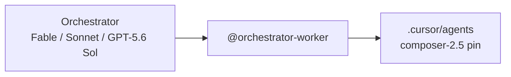

# Agent orchestration — Cursor IDE

A **premium orchestrator** (Fable 5, Sonnet 5, or GPT-5.6 Sol) plans in Cursor Agent chat. **Composer 2.5** workers run as subagents with explicit `model:` pins in `.cursor/agents/`.

---

## What goes where

| Piece                 | Location                                       | How it gets there                                                      |
| --------------------- | ---------------------------------------------- | ---------------------------------------------------------------------- |
| Procedure + templates | fixmyskills `agent-orchestration`              | Skills CLI → `.agents/skills/`                                         |
| Worker model pins     | `.cursor/agents/implementer.md`, `verifier.md` | `init-cursor.sh`                                                       |
| Orchestrator behavior | `.cursor/rules/orchestrator-worker.md`         | `init-cursor.sh`                                                       |
| Parent model          | Cursor Agent model picker                      | You pick an orchestrator each session                                  |
| Personal workers      | `~/.cursor/agents/`                            | Manual copy — see [cursor-personal-setup.md](cursor-personal-setup.md) |



Skills CLI does **not** install `.cursor/agents/` — run `init-cursor.sh` after `bunx skills add`.

---

## Bootstrap (one-time per repo)

```bash
bunx skills add FixMyBerlin/fixmyskills --skill agent-orchestration -a cursor -y
bash .agents/skills/agent-orchestration/scripts/init-cursor.sh
git add .cursor/agents .cursor/rules skills-lock.json
git commit -m "Add Cursor agent orchestration setup"
```

`TARGET_REPO=/path` overrides destination.

Reset templates: re-run `init-cursor.sh` (overwrites).

---

## Picking an orchestrator

| Model           | Good for                                                                                                  |
| --------------- | --------------------------------------------------------------------------------------------------------- |
| **Fable 5**     | Complex, long-running, multi-step agentic work; highest capability                                        |
| **Sonnet 5**    | Everyday coding with strong multi-step reasoning and reliable tool use                                    |
| **GPT-5.6 Sol** | Long-running agent work; can over-delegate on mid-sized tasks — keep one `/implementer` per cohesive task |

Workers stay on **Composer 2.5** regardless of orchestrator choice.

---

## Daily usage

1. Pick an orchestrator (Fable 5, Sonnet 5, or GPT-5.6 Sol).
2. Start large tasks with **`@orchestrator-worker`**:

```
@orchestrator-worker

Implement [feature]. You orchestrate only:
- explore for discovery
- /implementer for edits and tests
- /verifier before declaring done
Do not edit files yourself.
```

**Skip** trivial one-file edits — subagent startup costs more than inline work.

---

## Delegation

| Task                                       | Delegate to                    |
| ------------------------------------------ | ------------------------------ |
| Codebase search                            | Built-in `explore`             |
| Edits, tests, installs, state-changing git | `/implementer`                 |
| Read-only diagnostics (logs, status)       | Built-in `bash`                |
| Post-change validation                     | `/verifier` (readonly)         |
| Browser / UI                               | `browser` or agent-browser MCP |

Invocation: `/implementer [scoped brief]`, `/verifier [what to prove]`. For parallel work, send multiple subagent Task calls in one message.

Orchestrator may inline only trivial fixes (~10 lines) or when user says "no subagents".

---

## Worker model pins

`.cursor/agents/` frontmatter: `model: composer-2.5[fast=false]`. Verifier adds `readonly: true`. **Avoid** `inherit` or omitted model — bills at your orchestrator's rate. Parallel subagents = parallel token spend.

Cursor may fall back from a pinned worker model when blocked by admin, unavailable Max Mode, or plan limits.

---

## Customize & verify

- Edit copied files in the target repo (`verifier.md` check commands, rule delegation for MCP, etc.). Do **not** put orchestration in global Cursor User Rules — use `@orchestrator-worker` per task.
- Verify: `@orchestrator-worker` in rule picker; `/implementer` and `/verifier` show `composer-2.5[fast=false]`; delegation prompt spawns workers instead of editing directly.

---

## References

- [Cursor Subagents](https://cursor.com/docs/subagents)
- [Claude Fable 5](https://cursor.com/docs/models/claude-fable-5)
- [Claude Sonnet 5](https://cursor.com/docs/models/claude-sonnet-5)
- [GPT-5.6 Sol](https://cursor.com/docs/models/gpt-5-6-sol)
- Prototype: tilda-geo commit `9572b85`
