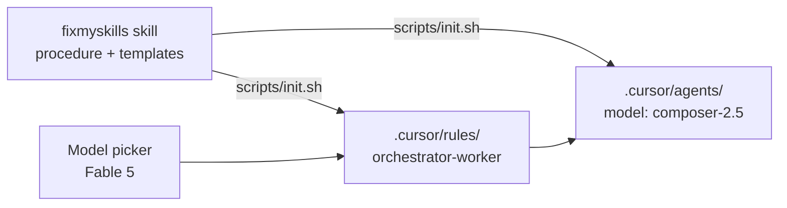

# What goes where

Placement table for Fable orchestrator + Composer worker setup.

| Piece                  | Location                                       | Installed by Skills CLI?                         | Committed to git?                 | When it applies                         |
| ---------------------- | ---------------------------------------------- | ------------------------------------------------ | --------------------------------- | --------------------------------------- |
| Bootstrap procedure    | fixmyskills `agent-orchestration` skill        | Yes → `.agents/skills/`                          | `skills-lock.json` in target repo | Agent reads when asked                  |
| Worker model pins      | Target `.cursor/agents/*.md`                   | **No** — `scripts/init.sh` copies templates      | Yes (team shares)                 | Every `/implementer`, `/verifier` spawn |
| Orchestrator behavior  | Target `.cursor/rules/orchestrator-worker.mdc` | **No** — `init.sh` copies template               | Yes                               | When you `@orchestrator-worker`         |
| Human cheat sheet      | Target `docs/agent-orchestration.md`           | **No** — `init.sh` copies (optional `--no-docs`) | Yes (recommended)                 | Humans + rule link                      |
| Parent model (Fable 5) | Cursor Agent model picker                      | N/A                                              | N/A                               | You pick each session (any effort tier) |
| Personal workers       | `~/.cursor/agents/`                            | Manual copy                                      | No (user machine)                 | All projects unless repo overrides      |

## Why three layers



- **Skill alone** does not pin worker models — Cursor reads `.cursor/agents/`, not `.agents/skills/`.
- **Rule alone** does not set worker models — rules have no `model:` frontmatter for subagents.
- **Agents alone** pin models but Fable may still edit files itself without the orchestrator rule.

## One-time vs every task

| Action                                                    | Frequency                                   |
| --------------------------------------------------------- | ------------------------------------------- |
| `bunx skills add … agent-orchestration`                   | Once per repo (or when updating skill)      |
| `bash .agents/skills/agent-orchestration/scripts/init.sh` | Once per repo (re-run to refresh templates) |
| Commit `.cursor/agents`, `.cursor/rules`, `docs/`         | Once per repo                               |
| Pick **Fable 5** (High / Medium / Low)                    | Each Agent session for orchestration        |
| `@orchestrator-worker` in prompt                          | Each large delegated task                   |

## Setup checklist

```
- [ ] bunx skills add FixMyBerlin/fixmyskills --skill agent-orchestration -a cursor -y
- [ ] bash .agents/skills/agent-orchestration/scripts/init.sh
- [ ] git add .cursor/agents .cursor/rules docs/agent-orchestration.md skills-lock.json
- [ ] Smoke: @orchestrator-worker in rule picker; /implementer and /verifier in subagent list
- [ ] Pick Fable 5; start task with @orchestrator-worker + delegation prompt
```

## Manual verification (Cursor UI)

1. Open Agent chat in the bootstrapped repo.
2. Type `@` — confirm `orchestrator-worker` appears in rules.
3. Confirm subagents `implementer` and `verifier` are listed (project `.cursor/agents/`).
4. Open agent files — `model: composer-2.5[fast=false]`, verifier has `readonly: true`.
5. Select Fable 5 (any effort tier), send delegation prompt — parent should spawn workers instead of editing directly.
